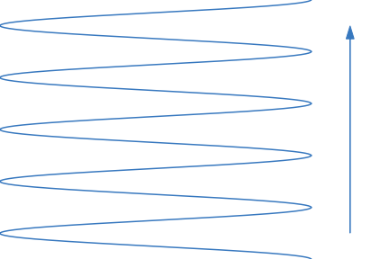
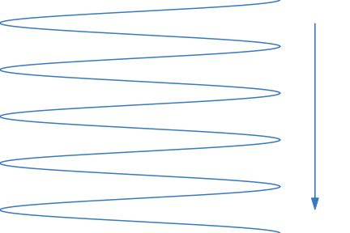
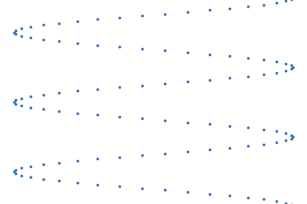
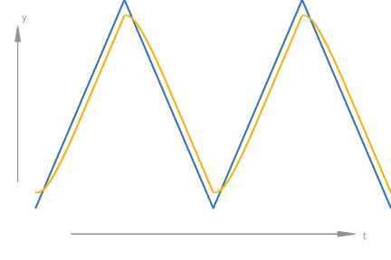
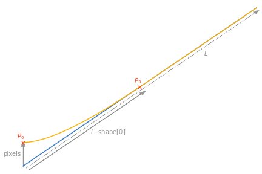
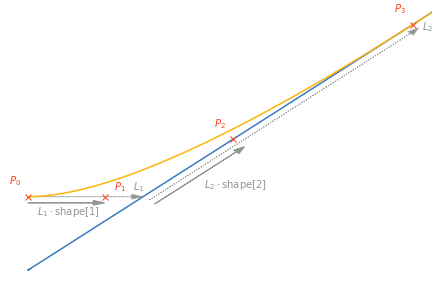
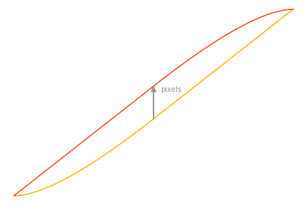

===============
Data processing
===============

.. highlight:: python
    :linenothreshold: 5

The data processing functionalities supported by the ``pyfastspm`` package are introduced in the following.

Loading ``.h5`` file
====================

To load data from a ``.h5`` file, run::

    ft = pyfastspm.FastMovie(file_name)

``file_name`` is the name of the ``.h5`` file to load. The ``FastMovie`` class can take two additional input arguments:

- ``x_phase`` and ``y_phase`` (int): The phase shift in units of data points (or 'pixels') between the input signal and the actual probe position in the fast and slow scan direction, respectively. If ``None`` is given (default), both phases default to the value in the metadata (see below).

The created object ``ft`` represents a FAST movie and, amongst others, has two main attributes: ``ft.data`` is a ``numpy`` array containing the actual movie data. At this point, it is just a 1D stream of output values from a FAST measurement on an equidistant time grid, but the shape and meaning of ``ft.data`` will change in the further treatment. ``ft.metadata`` is a python dictionary containing all relevant information about the data acquisition, e.g. scan frequency in y and x direction or the sampling rate.

``ft.data`` can be reloaded by::

    ft.reload_timeseries()

All previous changes to the ``data`` attribute are discarded, it is completely reverted to the unprocessed 1D signal stream. Just like the init function of the ``FastMovie`` class, this can take ``x_phase`` and ``y_phase`` arguments.

FFT filtering
=============

Video quality can be improved by applying filters to the - until now - unprocessed 1D data stream. To do so, the data has to be transformed into frequency domain using FFT, by calling::

    pyfastspm.convert_to_spectrum(ft)

This converts the ``ft.data`` array to the spectrum on an equidistant frequency grid. Now filters can be applied with::

    pyfastspm.filter_freq(ft, freqs, pars, types)

This applies *n* filters at once. The last three arguments are length *n* lists. Elements at the same position specify one filter:

- ``freqs`` (list of floats): Filter frequencies (in Hz).
- ``pars`` (list of floats): Filter parameters (width in Hz for all currently supported filter types).
- ``types`` (list of strings): Filter types. Currently allowed are:

  - ``'g'``: Eleminates the filter frequency by cutting out a Gaussian with the specified width (standard deviation) around it. The Gaussian is not normalized; the frequency in ``freqs`` is thus fully eliminated.
  - ``'h'`` and ``'l'``: High and low pass filters using Gaussian cumulative distribution function (CDF). At the filter frequency they have the value 0.5 and they have the specified width (standard deviation of the derivative).

Noise can be suppressed by calling::

    pyfastspm.filter_noise(ft, thresh, sigma)

This again uses a Gaussian CDF, this time as a function of intensity instead of frequency. Each data point in the spectrum is diminished according to its own value. Values at ``thresh`` (float) are reduced to their half, lower values are reduced more drastically, higher values are reduced less. ``sigma`` (float) defines the width (in intensity domain) of the filter. Strong noise filters seem to effectively perform time averaging. Comparison with an unfiltered movie is thus highly encouraged. If features which were moving in the unfiltered movie leave behind a 'shadow' or do not move at all, it is likely that a noise filter with ``thresh`` set too high has been applied.

The real part of the spectrum can be visualized by::

    pyfastspm.show_fft(ft)

``show_fft`` takes two additional arguments:

- ``range_display`` (2-tuple of floats): Range (in Hz) of the spectrum to be displayed. If ``None`` is given (default), the entire spectrum is displayed.
- ``filename`` (string): File path to save the image. If ``None`` is given (default), the spectrum is shown on screen instead.

Once FFT filtering is done, ``ft.data`` has to be transformed back into time domain by::

    pyfastspm.convert_to_timeseries(ft)

Reshaping to movie
==================

To get actual images from the 1D data stream, ``ft.data`` has to be reshaped into an array of frames. This is done by calling the method::

    ft.reshape_to_movie(channels)

For reshaping, the data points are divided into subsets referred to as 'channels' according to the direction in which the probe was moving during their acquisition: upward ``u`` or downward ``d`` in the slow direction and forward ``f`` or backward ``b`` in the fast direction. During the acquisition, the probe moves over the sample in a sinusoidal shape, alternatingly upward and downward:

E.g. the ``uf`` channel contains only data acquired while the probe was moving upward and forward:

``channels`` is a string specifying which portion of the data should be used. The first part is ``u``, ``d`` or ``ud``, the second part is ``f``, ``b`` or ``i``. ``i`` ('interlaced') uses data from both forward and backward directions.

``ft.data`` is reshaped to a 3D array. The outermost dimension ``0`` represents frames, the middle dimension ``1`` represents lines and the innermost dimension ``2`` represents columns. To be more precise one frame ``ft.data[i,:,:]`` consists of the data measured during one ``u`` or ``d`` probe movement. In ``ud`` mode, the frames alternate between ``u`` and ``d``. One line ``ft.data[i,j,:]`` consists of the data measured during one ``f`` or ``b`` probe movement. In ``i`` mode, the lines alternate between ``f`` and ``b``. One column ``ft.data[i,:,k]`` consists of data measured at the same x coordinate.

With ``channels='udi'`` the full acquired data is reshaped to the movie. In all other cases information is discarded! ``u`` and ``d`` movies only have half as many frames as corresponding ``ud`` movies, reducing time resolution. ``f`` and ``b`` movies only have half as many lines as ``i`` movies, reducing spatial resolution in y direction.

``b`` lines are inverted along matrix dimension ``2``, such that each line contains data ordered from left to right, rather than ordered in time. In a similar fashion, ``u`` frames are inverted along matrix dimension ``1``, such that each column is ordered from top to bottom (of the image) rather than being ordered in time.

Because all frames in a ``u`` (or ``d``) movie are contained within the corresponding ``ud`` movie, but have different indices in the ``ft.data`` array, a convention is introduced that 'frames' refers to actual frames and the frame number is equal to the actual index in the array, and 'images' are defined such that they behave equally for all channel combinations, which means that in ``ud``, an image consists of 2 frames: one ``u`` and one ``d`` frame. One image thus represents one full period of the probe movement.

Correction for non-linear probe movement
========================================

In classical ('slow') scanning probe microscopy (SPM), the probe approaches equidistant grid points on the sample surface, one at a time. Measured data points can thus immediately be used as pixels. In FAST SPM however, the grid of points at which the data in the original 1D stream were measured has a sinusoidal shape. On this sinusoidal curve, the *data points* (blue in subsequent figures) are equally spaced in y direction (but naturally not in x direction), as opposed to classical SPM, were *lines* are equally spaced and each *data point* on a line has the *same* y coordinate:

To get values which can be used as pixels, equidistant grid points have to be interpolated between those measurement points. Dimension ``1`` will then represent the y coordinate or line number and dimension ``2`` will represent the x coordinate or column number. ``ft.data[0,0,0]`` will be the top left pixel of the first (or within python 'zeroth') frame, ``ft.data[0,0,-1]`` will be the top right pixel of the same frame etc. The interpolation is carried out by using sparse matrices, that connect the sine grid points with the square grid points of the frame. The connection is defined through a 'Delaunay triangulation'.

This is done by calling::

    pyfastspm.interpolate(ft)

This function can take following arguments.

- ``offset`` (float): Shifts the grid of interpolation points in y direction. Defaults to ``0``. Unit is pixels. Should not exceed the range of [-0.5, 0.5], as the interpolation grid moves out of the range of data points otherwise.
- ``grid`` (2D-array): Sine grid of measured data points.
- ``image_range`` (2-tuple): To be interpolated frames.
- ``interpolation_matrix_up`` (scipy sparse matrix): Connections between measured points and pixels.
- ``interpolation_matrix_down`` (scipy sparse matrix): Connections between measured points and pixels.
- ``give_grid`` (boolean): If True interpolation matrices for up and down frames are returned, else ft.data is interpolated.

The function has to be called twice. The first time to calculate the interpolation matrices, and the second time to interpolate the frames.

Creep correction
================

'Probe creep' refers to the phenomenon of the actual probe position running behind the input signal at the piezo actuators. In the fast scan direction, where the input signal is a sine function, this only leads to a phase shift and is fully accounted for by the ``x_phase`` argument of ``reload_timeseries`` or the init function of the ``FastMovie`` class, respectively.

In the slow scan direction however the issue is more complex. When the signal (blue) changes direction, the system has some amount of backlash and the probe position (yellow) starts moving slower than it would under steady conditions:

In ``interpolate`` the real path (yellow) is constructed in a coordinate system of (real) probe position vs. ideal position, both in the unit of data points. The ideal path (blue) is thus a line through the origin with slope 1. The curve shape after the turning point is approximated by a cubic Bezier curve. The shape of this curve is defined by the parameters ``pixels`` (float) and ``shape`` (3-tuple of floats, all within the range [0,1]) which are handed to ``interpolate``. The first control point of the Bezier curve is shifted from the starting point of the ideal path by ``pixels``. The last control point lies on the ideal path, at ``shape[0]`` of the way between starting and end point. Beyond that point, the real position runs parallel to the ideal position:

The two middle control points are constructed from an auxiliary point which lies on the ideal path, at the same hight as the first point. The second point lies at ``shape[1]`` of the way between the first point and the auxiliary point. The third point lies at ``shape[2]`` of the way between the auxiliary point and the last point:

This construction ensures that the derivative of the Bezier curve smoothly transitions into that of the linear region.

Finally, the curves are shifted such that the curves of the updward (yellow) and downward (red) direction form a closed hysteresis cycle:

``pixels`` thus defines by how many pixels the uncorrected movie 'shakes' between ``u`` and ``d`` frames in the center of the image. ``Bezier_points`` defines the number of points at which the Bezier curve is numerically calculated. Between these points, the curve is linearly interpolated. Default values are: ``shape=(1/2, 2/3, 1/3)``, corresponding to a quadratic Bezier curve with the auxiliary point as middle control point, converging to linear movement at the half path, ``pixels=0``, corresponding to no creep correction, and ``Bezier_points=1000``.

This correction for the Creep is carried out by adjusting the sine grid of the measured points with regard to the fitted bezier. Thus it is enough to only interpolate the movie data once.

The correction is carried out by creation of a object of the creep class::

    creep = pyfastspm.Creep(ft)

The class takes two optional parameters. 1) ``index_to_linear`` describes the transition from the accelerated to the linear motion for ``'sin'`` creep mode. 2) ``creep_mode`` sets the creep mode for either ``'sin'`` of ``'root'``. The Bezier creep correction is carried out by the method::

    creep.fit_creep_bez(col_inds ,w, known_input)

- ``col_inds`` (list of int): The columns that are used for the optimisation of the Bezier.
- ``w`` (float): Gives *additional* weight to the pixels at the upper and lower frame boundary in the penalty function of the fitting algorithm. E.g. with ``w=1``, these pixels are weighted *twice* as much as pixels in the center of the image. For pixels in between, the weight function has a parabolic form with its vertex in the center of the image. Defaults to ``0``.
- ``known_input`` (3-tupel): Optional, the optimized Bezier parameters for manual adjustments.

The method returns the optimized Bezier and the adjusted sine-grid. For the rare case that the Bezier fit doesn't deliver the wanted results, the there is also a sine fit available. Due to strong restraints this fit works also with particular difficult fits. It is called by the method::

    creep.fit_creep(initial guess, frames, known_params)

The method only has the following optional arguments:

- ``initial_guess`` (n-tuple): the length of the tuple depends on the number of parameters of the creep function. For ``'sin'`` is a 1-tuple for phase.
- ``frames`` (list): indices of frames used to caclucate the creep.
- ``known_params`` (n-tuple of None): Optional, if not None the given tuple will be used as creep parameters.

The method returns the creep adjusted grid .

Drift correction
================

The drift correction uses a fft-correlation to construct a drift path. The frames that are correlated are a certain ``stepsize`` apart. If the ``stepsize`` is large the driftpath regrades only the general motion, if the ``stepsize`` is small, wiggling motions of the sample can make the driftpath shaky. Furthermore a median-filter and a boxcar-filter is used to make the smoothen the drift path. The drift is corrected trough an object of the drift class::

    drift = pyfastspm.Drift(ft, stepsize, corrspeed, show_path, boxcar)

The class has the following arguments:

- ``stepsize`` (int): Distance between two frames that are correlated.
- ``corrspeed`` (int): Distance between two correlation e.g. if two correlation between 1-20, 3-22, 5-24 ... if one 1-20, 2-21 ...
- ``show_path`` (boolean): If True the driftpath is plotted.
- ``boxcar`` (boolean): Parameter weather boxcar filter is applied.

The drift correction is applied trough the method::

    drift.correct(mode, known_drift)

The drift corrected frames and the drift_path are returned. Further more the driftpath is saved as a .drift.txt file. This file can be used to adjust the driftpath manually. The saved path can be loaded again. The method takes the following arguments:

- ``mode``: Either 'full' or 'common'. Decides weather the video is enlarged or cut down to the common area to show the drift.
- ``known_drift``: If False, drift is calculated. If 'integrated', the integrated columns are used as driftpath. If 'sequential', the sequential columns are used to calculate the driftpath.

2D filtering
============

``pyfastspm`` supports a convolutional filter which can be applied to ``FastMovie`` objects once they are reshaped to a movie, regardless of the channels::

    pyfastspm.conv_mat(ft, matrix)

``matrix`` is a 2D array with which the movie is convolved, where the first (outer) dimension corresponds to the y direction and the second (inner) dimension corresponds to x. ``conv_mat`` also supports an ``image_range`` argument.

Export
======

The processed movie can be exported as ``.mp4`` video by calling the method::

    ft.export_movie()

In a similar manner, individual frames can be exported as ``.png`` images (and some other formats) with::

    ft.export_frame(images=(<first image index>, <last image index>), channel=<channel string>)

For additional arguments which can be given to both methods, see API reference.

After all processing and exporting is done, the ``.h5`` file should be closed by calling::

    ft.close()
